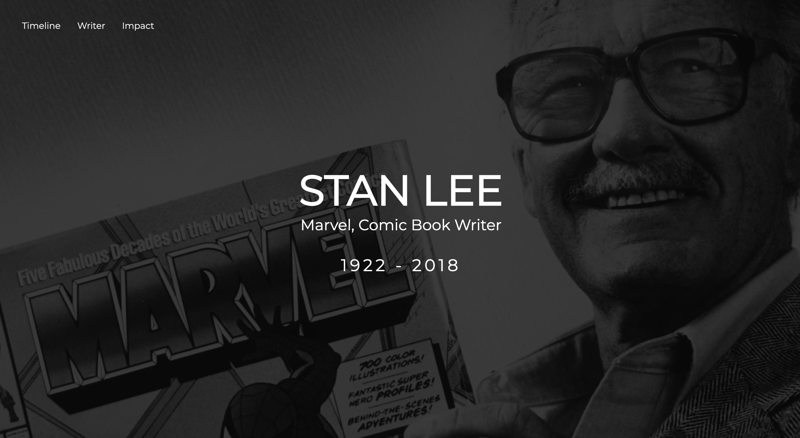

# Tribute Page  
  ## Instructions
  1. Choose someone you look up to and build a tribute page using the user stories down below.

  ## User Stories
  1. As a user, I want my tribute page to have an element with a corresponding id="main" which will contain all other elements. 
  2. As a user, I want to see an element with a corresponding id=“title”,   which contains a string (i.e. text) that describes the subject of the tribute page (e.g. “Steve Jobs”).
  3. As a user, I want to see a div element with a corresponding id=“img-  div”.
  4. As a user, I want to see a an img element with a corresponding id=“image” within the 'img-div' element.
  5. As a user, I want to see an element with a corresponding id="img caption" that contains text content describing the image show in img   div.
  6. As a user, I want to see an element with a corresponding id="tribute info" which contains text content describing the subject of the    tribute
  page.
  7. As a user, I want to see an element with a corresponding id=“tribute- link”, which links to an outside site that contains
     additional information about the subject of the tribute page.
     - _Hint: You must give your element an attribute of target and set it to blank in order for your link to open in a new tab (i.e.target=“_blank”).__
  9. As a user, I want the img element to be responsive to resizing, relative to the width of its parent element.
  10. As a user, I want the img element to be centered within its parent element.
  11. As a user, I want to read a post, article, or story about the person with at least 2 headings in h1 ... h6, and paragraphs in p.

  ## Sample Projects:
  
  